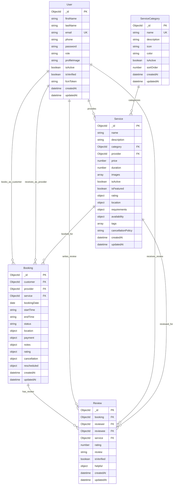

# SmartServe API - Entity Relationship Diagram

## Database Schema ER Diagram



## Entity Descriptions

### User Entity
- **Primary Key**: `_id` (ObjectId)
- **Unique Fields**: `email`
- **Roles**: customer, provider, admin
- **Provider-specific fields**: businessName, businessAddress, experience, rating, workingHours
- **Customer-specific fields**: address, preferences

### ServiceCategory Entity
- **Primary Key**: `_id` (ObjectId)
- **Unique Fields**: `name`
- **Purpose**: Categorizes services (Home Cleaning, Plumbing, etc.)

### Service Entity
- **Primary Key**: `_id` (ObjectId)
- **Foreign Keys**: `category` (ServiceCategory), `provider` (User)
- **Features**: Pricing, duration, availability, location settings
- **Search**: Text index on name, description, tags

### Booking Entity
- **Primary Key**: `_id` (ObjectId)
- **Foreign Keys**: `customer` (User), `provider` (User), `service` (Service)
- **Status Flow**: pending → confirmed → in_progress → completed
- **Payment**: Integration with Stripe/PayPal
- **Location**: Service location details

### Review Entity
- **Primary Key**: `_id` (ObjectId)
- **Foreign Keys**: `booking`, `reviewer`, `reviewee`, `service`
- **Purpose**: Bidirectional rating system
- **Features**: Helpful votes, verified reviews

## Relationships

1. **User → Service** (1:N)
   - One provider can offer multiple services
   - One service belongs to one provider

2. **ServiceCategory → Service** (1:N)
   - One category can have multiple services
   - One service belongs to one category

3. **User → Booking** (1:N) - Customer
   - One customer can make multiple bookings
   - One booking belongs to one customer

4. **User → Booking** (1:N) - Provider
   - One provider can receive multiple bookings
   - One booking belongs to one provider

5. **Service → Booking** (1:N)
   - One service can be booked multiple times
   - One booking is for one service

6. **Booking → Review** (1:N)
   - One booking can have multiple reviews (customer and provider)
   - One review belongs to one booking

7. **User → Review** (1:N) - Reviewer
   - One user can write multiple reviews
   - One review is written by one user

8. **User → Review** (1:N) - Reviewee
   - One user can receive multiple reviews
   - One review is for one user

9. **Service → Review** (1:N)
   - One service can have multiple reviews
   - One review is for one service

## Indexes

### User Collection
- `email` (unique)
- `role`
- `isActive`

### Service Collection
- `name` (text), `description` (text), `tags` (text)
- `category`
- `provider`
- `isActive`
- `isFeatured`

### Booking Collection
- `customer`
- `provider`
- `bookingDate`
- `status`
- `service`

### Review Collection
- `booking` (unique with reviewer)
- `reviewer`
- `reviewee`
- `service`

## Sample Data Structure

### User (Provider)
```json
{
  "_id": "60f7b3b3b3b3b3b3b3b3b3b3",
  "firstName": "Robert",
  "lastName": "Wilson",
  "email": "robert.wilson@email.com",
  "role": "provider",
  "providerInfo": {
    "businessName": "Wilson Cleaning Services",
    "experience": 5,
    "rating": { "average": 4.8, "count": 25 }
  }
}
```

### Service
```json
{
  "_id": "60f7b3b3b3b3b3b3b3b3b3b4",
  "name": "Deep House Cleaning",
  "category": "60f7b3b3b3b3b3b3b3b3b3b1",
  "provider": "60f7b3b3b3b3b3b3b3b3b3b3",
  "price": 150,
  "duration": 180
}
```

### Booking
```json
{
  "_id": "60f7b3b3b3b3b3b3b3b3b3b5",
  "customer": "60f7b3b3b3b3b3b3b3b3b3b2",
  "provider": "60f7b3b3b3b3b3b3b3b3b3b3",
  "service": "60f7b3b3b3b3b3b3b3b3b3b4",
  "bookingDate": "2024-01-25",
  "status": "completed"
}
```
